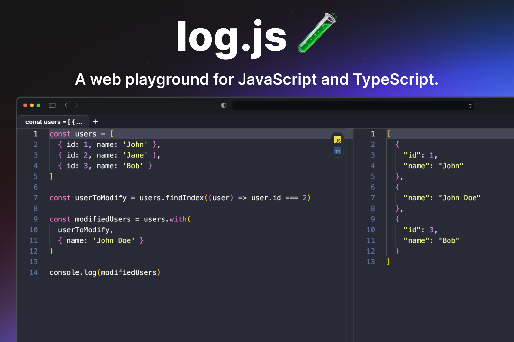

<p align="center">
  
</p>

## Getting Started

Install the dependencies:

```bash
pnpm i
```

Run the development server:

```bash
pnpm dev
```

## 🤝 Contributing

Want to contribute? [**Open an issue**](https://github.com/felipetodev/log.js/issues/new) with your proposal ✨ (soon we will have a contributing guide).
